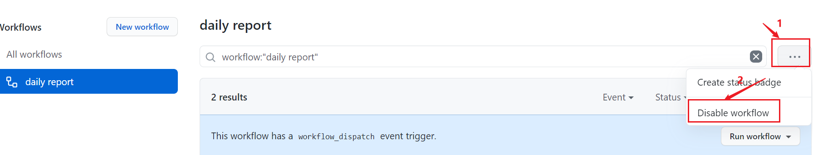

# SHU_dailyReport

**仅供交流学习**  
感谢YMZLT大佬！！
# 项目简介

  该项目基于python的request库和bs4库实现上海大学的自动报送。可部署于服务器或者GitHub Action来实现每天自动报送。  

  - report.py 可自行判断是否在校，离校生的报送信息（地址等）根据上次报送信息填写。由于用到正则匹配之前的报送信息，所以网站信息更新后项目可能会失效。
  - oneReport.py 用于离校以后当天的每日一报；
  - twoReport.py 用于在校生当天的每日两报；
  - delayReport.py 用于一次性补报之前日期。（目前没法用，会尽快加上）

  以上四个脚本文件都可单独运行，可根据需要选择。
  
  

## 本地报送和补报

1. 把代码clone到本地

   ```
   https://github.com/zsksmhq/dailyReport.git
   ```
2. 安装依赖库（见requirements.txt)
3. 运行report.py进行当日报送
   ```python
   python delayReport.py 学号 密码 补报天数
   ```
5. 运行OneReport.py进行每日一报当日报送
   ```python
   python twoReport.py 学号 密码 详细地址
   ```
   详细地址需要提供所在地的省、市、县/区、具体住址,用逗号分隔（注意是英文逗号，省份不要加省字）
   例如：
   
   ```python
   python twoReport.py 1812**** 12345678 安徽,合肥市,肥东县,肥东一中
   ```
6. 运行twoReport.py进行每日两报当日报送
   ```python
   python twoReport.py 学号 密码
   ```

## GitHub Action自动报送

### 1、把代码fork到你的仓库

### 2、邮箱配置（可选）

github action 实现自动发邮件需要一个配置SMTP服务的邮箱（qq邮箱、163邮箱等）。以配置163邮箱为例，先登录邮箱，点击设置，选择POP3/SMTP/IMAP,然后开启SMTP服务。

开启服务后会生成一个专用授权密码，将该密码记录下来，用于下面的Secrets配置。

### 3、Secrets 配置

进入自己 fork 的仓库，点击 Settings-> Secrets-> New Secrets， 添加 1 个 Secrets，其名称为`STUDENTID`，值为自己的学号。它们将作为配置项，在应用启动时传入程序。然后再添加一个Secrets，`PASSWORD`值为自己的密码。


如果需要发送邮件的话还需要配置下面三个 Secrets：

  - `MAIL_USERNAME` 自动发邮件的邮箱号
  - `MAIL_PASSWORD` 自动发邮件的邮箱授权密码，就是开通邮箱STMTP服务时记录下来的密码
  - `MAIL_BOX` 接受邮件的邮箱号

如果为每日一报的话还需要配置所在地址的 Secrets：

  - `LOCATION`    所在地的详细地址(需要提供所在地的省、市、县/区、具体住址,用逗号分隔)s
    例如：安徽,合肥市,肥东县,肥东一中
    注意：分隔符为英文逗号，省份不需要加省字

### 4、手动运行工作流
都配置好后，请手动开启 Actions，执行一次工作流，验证是否可以正常工作，操作步骤如下图所示：


运行结束后，可查看运行日志：


- report 默认是每天0点和16点整触发运行;
- oneReport 默认是每天0整触发运行;
- twoReport 默认是每天0点和16点整触发运行;

可以根据需要选择对应的工作流运行。

因为github action自身的原因，每次运行会有**半个小时左右的延迟**。另外如果想要设置自己的运行时间，详见下面**常见问题**。

### 5、运行结束后，会有邮件发送


## 常见问题

### 1、不想接收邮件

不想接收邮件的话，删除.github/workflows中的oneReport.yml或twoReport.yml中下面的部分代码，同时在secrets中不配置邮箱。
```shell
# 执行
      - name: 'execute report'
        run: python report.py ${{ secrets.STUDENTID }} ${{ secrets.PASSWORD }} ${{ secrets.LOCATION }}
        
      # 获取格式化的日期并存入GitHub内置的环境变量中
      - name: 'Get Date'
        run: echo "REPORT_DATE=$(TZ=':Asia/Shanghai' date '+%Y-%m-%d %T')" >> $GITHUB_ENV
      
      # 发送邮件
      - name: 'Send mail'
        uses: dawidd6/action-send-mail@master
        with:
          # 这些是发送邮件需要配置的参数，更多详细的说明请访问具体的仓库
          server_address: smtp.163.com
          server_port: 465
          # 这些secret的环境变量需要配置在setting中的secret下
          username: ${{ secrets.MAIL_USERNAME }}
          password: ${{ secrets.MAIL_PASSWORD }}
          subject: 每日一报 (${{env.REPORT_DATE}})
          body: "每日一报 报送成功"
          to: ${{ secrets.MAIL_BOX }}
          from: GitHub Actions
          content_type: text/html
```
### 2、修改运行时间report

每日任务执行的时间，由.github/workflows中的oneReport.yml或twoReport.yml中的cron表达式指定，每日两报默认为每日的0点整和16点:

```yml
schedule: # 定时触发
    # cron表达式，时区是UTC时间，比我们早8小时，如下所表示的是16表示的是每天0点0分
    - cron: '0,0 16,8 * * *'
```

**若要修改为自己指定的时间执行，有如下两种方式：**

- 方法一：修改yaml文件中的cron表达式
  我们可以直接修改上述该文件中的cron表达式，然后提交。

个人不建议这么做，因为以后更新要注意冲突与覆盖问题，建议使用下面的方法二。

- 方法二：添加 GitHub Environments 并设置延时
  v1.1.3及之后版本，支持通过添加GitHub Environments来设置延时运行，即在每日0点整触发 Actions 后，会再多执行一个延时操作，延时时长可由我们自己设置。

  比如想设置为每天8点执行，只需要将这个延时时常设置为480分钟（8个小时）即可。方法如下：

  - Ⅰ. 找到 Production Environments
    		运行完twoReport.yml 之后，在 Settings ——> Environments 中会自动多出一个名为 Production 的环境，如下图所示：
    
  - Ⅱ.设置延时时长
    勾选 Wait timer，并填写延时时长，单位为分钟，如下图所示：
    

  设置成功后，再次运行 Actions 会发现触发后会自动进入倒计时状态，等倒计时结束(这里我设置的是1分钟)后才会真正运行之后的内容，如下图所示：
  

### 3、停止运行

之后要是不需要每天填报了，那进入setting->action->选择Disable Actions for this repository。该仓库的所有的工作流将不再运行。
如果只停止一个工作流，可以直接在 Actions 中设置：👇

## 文件说明
>dailyReport:.
│  delayReport.py 补报脚本
│  oneReport.py 每日一报脚本v2
│  README.md 说明文档
│  report.py 自动判断每日一报/每日两报
│  report_at_school.py 每日两报脚本v1
│  report_leave_school.py 每日一报脚本v1
│  request2json.py 将截获的post表单转成json格式
│  requirements.txt 安装依赖
│  see_FState.py 用来看fstate值
│  twoReport.py 每日两报脚本v2
│
├─.github
│  └─workflows
│          oneReport.yml 每日一报工作流
│          report.yml 自动判断每日一报/每日两报工作流
│          twoReport.yml 每日两报工作流
│
├─.idea
│
├─data  
│      data.json 从报送页面截获的body转成的表单数据
│      F_State.json 表单数据中的状态数据（解码后的数据）
│      requestBody.txt 从报送页面截获的body
│
├─images 文档图片
## 参考链接

[GitHub Actions 入门教程](http://www.ruanyifeng.com/blog/2019/09/getting-started-with-github-actions.html)

[BiliBiliTool](https://github.com/RayWangQvQ/BiliBiliTool)

[GitHub Actions 教程：定时发送天气邮件](http://www.ruanyifeng.com/blog/2019/12/github_actions.html)

[Python实现自动签到脚本](https://blog.csdn.net/ydydyd00/article/details/80882183)

[手动触发 GitHub Actions 的几种方式](https://p3terx.com/archives/github-actions-manual-trigger.html)
